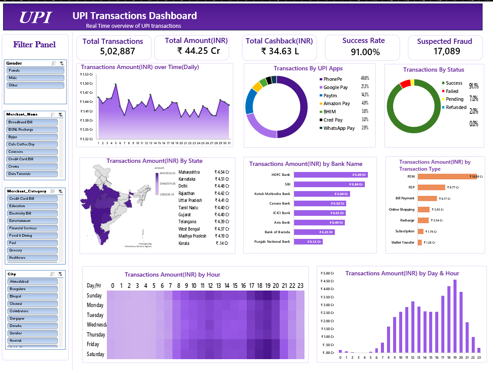

# 📊 UPI Transactions Dashboard – Excel

An interactive **UPI Transactions Dashboard built in Microsoft Excel** to analyze and visualize UPI transaction data across multiple dimensions such as transaction amount, transaction volume, cashback, success rate, fraud, banks, states, payment apps, transaction types, and time.

The dashboard provides a consolidated view of UPI transaction performance through interactive filters, charts, KPIs, and geographical analysis.

---

## 📌 Dashboard Preview

---

## 🎯 Project Objective

The objective of this project is to create an interactive and visually appealing Excel dashboard that helps users:

- Monitor overall UPI transaction performance
- Analyze transaction amounts and volumes
- Track cashback and success rates
- Identify suspected fraudulent transactions
- Compare UPI applications
- Analyze transactions by bank
- Understand state-wise transaction activity
- Identify popular transaction types
- Analyze transaction trends by day and hour
- Explore transaction patterns using interactive filters

---

## 📈 Key Performance Indicators

The dashboard includes the following major KPIs:

| KPI | Value |
|---|---:|
| Total Transactions | 5,02,887 |
| Total Amount | ₹44.25 Cr |
| Total Cashback | ₹34.63 L |
| Success Rate | 91.00% |
| Suspected Fraud | 17,089 |

---

## 📊 Dashboard Components

### 1. Transactions Amount Over Time
A daily trend chart showing how transaction amounts fluctuate throughout the month.

### 2. Transactions by UPI Apps
A donut chart showing the distribution of transactions across major UPI applications, including:

- PhonePe
- Google Pay
- Paytm
- Amazon Pay
- BHIM
- Cred Pay
- WhatsApp Pay

### 3. Transactions by Status
Shows the distribution of transaction outcomes:

- Successful
- Failed
- Pending
- Refunded

### 4. Transactions Amount by State
A geographical visualization of transaction amounts across Indian states.

This helps identify regions with higher transaction activity.

### 5. Transactions Amount by Bank
A comparison of transaction amounts processed through different banks, including:

- HDFC Bank
- SBI
- Kotak Mahindra Bank
- Canara Bank
- ICICI Bank
- Axis Bank
- Bank of Baroda
- Punjab National Bank

### 6. Transactions Amount by Transaction Type
Breakdown of transaction value across different transaction types:

- P2M
- P2P
- Bill Payment
- Online Shopping
- Recharge
- Subscription
- Wallet Transfer

### 7. Transactions Amount by Hour
A heatmap showing transaction activity across different hours of the day and days of the week.

### 8. Transactions Amount by Day & Hour
A column chart highlighting transaction patterns across different hours.

---

## 🎛️ Interactive Filters

The dashboard contains interactive filters/slicers that allow users to analyze the data based on:

- Gender
- Merchant Name
- Merchant Category
- City

These filters make it possible to perform targeted analysis and drill down into specific segments.

---

## 🛠️ Tools & Technologies

- **Microsoft Excel**
- Excel Pivot Tables
- Pivot Charts
- Slicers / Filters
- Conditional Formatting
- Excel Formulas
- Data Visualization
- Geographic/Map Visualization

---

## 🔍 Key Insights

The dashboard can be used to answer questions such as:

- Which UPI app handles the highest transaction share?
- Which banks process the highest transaction amounts?
- Which states contribute the most transaction value?
- What is the overall UPI transaction success rate?
- Which transaction types generate the highest transaction amounts?
- At what time of day are transactions most active?
- Which days and hours show the highest transaction activity?
- How significant are failed, pending, and refunded transactions?
- Which merchants and merchant categories contribute the most transactions?
- How many transactions are flagged as suspected fraud?

---

